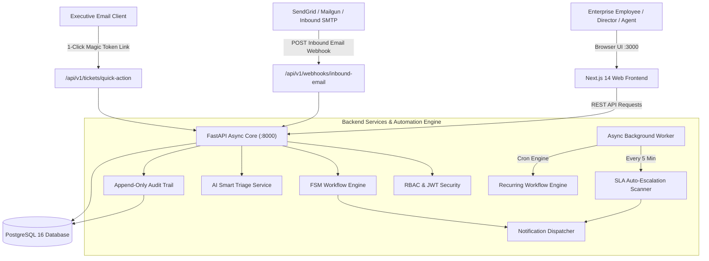

# NexusFlow: Enterprise Workflow & Ticketing Automation System

[](https://fastapi.tiangolo.com)
[](https://nextjs.org)
[](https://www.postgresql.org)
[](https://www.docker.com)
[](https://pytest.org)

**NexusFlow** is a modular, high-performance, enterprise-grade ticketing and business workflow automation platform built from scratch with **FastAPI (Async Python 3.11+)**, **SQLAlchemy 2.0 ORM**, **PostgreSQL 16**, and a **Next.js 14 App Router** frontend with Tailwind CSS and Radix UI.

---

## System Architecture



---

## Key Enterprise Capabilities

### 1. Inbound Email Ingestion Webhook
- **Universal Gateway**: Accepts inbound email webhooks (`POST /api/v1/webhooks/inbound-email`) compatible with SendGrid Inbound Parse, Mailgun Routes, Postmark, and custom SMTP relays.
- **Zero-Friction Requester Provisioning**: Automatically registers unverified external accounts upon receiving inbound emails.
- **AI-Powered Routing**: Automatically triages incoming subjects and email bodies to deduce the target department (`IT`, `FIN`, `HR`, `SD`, `PROC`), priority level, and contextual tags.
- **Immediate Confirmation**: Dispatches an instant acknowledgement email back to the sender with their unique ticket number and SLA target.

### 2. 1-Click Magic Email Approvals
- **Frictionless Executive Decisioning**: Directors and Authorizers receive high-priority approval requests with embedded, cryptographically signed 1-Click decision buttons.
- **Short-Lived Signed JWTs**: Action tokens (`type: "quick_action"`) are signed with HMAC-SHA256 and valid for 48 hours.
- **Endpoint**: `GET /api/v1/tickets/quick-action?token=...`
- **Branded Confirmation Experience**: Renders a rich HTML status confirmation screen detailing the execution timestamp, authorizer credentials, and audit record.

### 3. Finite State Machine (FSM) & Immutable Audit Trail
- **Deterministic Workflows**: Multi-department workflow transitions enforced strictly according to department policies (`DRAFT` → `SUBMITTED` → `PENDING_APPROVAL` → `APPROVED` / `REJECTED` → `IN_PROGRESS` → `RESOLVED` → `CLOSED`).
- **Cryptographic Append-Only History**: Every state change, metadata patch, SLA escalation, and notification event is permanently logged to `ticket_audit_logs`.

### 4. Background Worker & SLA Auto-Escalation Engine
- **Asynchronous Lifespan Scheduler**: Built directly into the FastAPI application lifespan.
- **SLA Breach Scanner**: Scans active tickets every 5 minutes against priority SLAs (`CRITICAL: 4h`, `HIGH: 12h`, `MEDIUM: 24h`, `LOW: 48h`). Flags `is_escalated = True` and logs audit events upon breach.
- **Cron Recurring Schedules**: Generates recurring maintenance and audit tickets on scheduled cron intervals (e.g. `0 9 1 * *`).

### 5. AI Smart Triage Engine
- Contextually infers department queues, extracts dollar amounts and entities, calculates confidence scores (0.0 to 1.0), and generates first-response suggestions.

---

## 1-Command Production Deployment (Docker Compose)

Launch the complete stack (PostgreSQL 16 + FastAPI Backend + Next.js Frontend) with a single command:

```bash
# Clone and enter directory
cd "f:/Tickting System"

# Launch all containerized services
docker compose up --build
```

### Access URLs:
- **Web Dashboard**: [http://localhost:3000](http://localhost:3000)
- **FastAPI OpenAPI Swagger**: [http://localhost:8000/docs](http://localhost:8000/docs)
- **FastAPI ReDoc**: [http://localhost:8000/redoc](http://localhost:8000/redoc)
- **PostgreSQL Database**: `localhost:5432` (`ticketing_db`)

---

## Pre-Seeded Personas & Demo Accounts

The database is pre-populated with departments, workflows, and 9 role-tailored accounts:

| Email | Password | Role | Department | Primary Queue / View |
| :--- | :--- | :--- | :--- | :--- |
| `admin@enterprise.local` | `AdminPassword123!` | `ADMIN` | Universal Override | Universal System Controls |
| `fin.director@enterprise.local` | `FinDirectorPass123!` | `AUTHORIZER` | Finance & Budgeting | Pending Executive Authorizations |
| `fin.agent@enterprise.local` | `FinAgentPass123!` | `ASSIGNEE` | Finance & Budgeting | Finance Department Queue |
| `it.lead@enterprise.local` | `ItLeadPass123!` | `AUTHORIZER` | Information Technology | IT Requisition Approvals |
| `it.agent@enterprise.local` | `ItAgentPass123!` | `ASSIGNEE` | Information Technology | Technical Operations Queue |
| `hr.manager@enterprise.local` | `HrManagerPass123!` | `AUTHORIZER` | Human Resources | Headcount Authorizations |
| `hr.agent@enterprise.local` | `HrAgentPass123!` | `ASSIGNEE` | Human Resources | Recruitment & Onboarding Queue |
| `requester@enterprise.local` | `RequesterPass123!` | `REQUESTER` | General Personnel | My Submitted Requests |
| `auditor@enterprise.local` | `AuditorPass123!` | `OBSERVER` | Compliance & Risk | Immutable Audit Logs (Read-Only) |

> **Interactive Persona Switcher**: In the web UI at `http://localhost:3000`, use the floating **Role Switcher** widget at the bottom right to switch between roles in 1 click!

---

## Local Development Setup (Without Docker)

### 1. Backend Setup
```bash
# Create and activate virtual environment
python -m venv venv
# Windows:
.\venv\Scripts\activate
# Linux/macOS:
source venv/bin/activate

# Install dependencies
pip install -r requirements.txt

# Seed initial database records (SQLite by default)
python -m app.seed

# Start FastAPI dev server with reload
uvicorn app.main:app --reload --port 8000
```

### 2. Frontend Setup
```bash
cd enterprise_ticketing_web

# Install dependencies
npm install

# Run development server
npm run dev
```

---

## Automated Test Suite

The project includes an end-to-end asynchronous test suite powered by `pytest` and `httpx`:

```bash
# Run all 22 automated tests
pytest -v
```

### Test Coverage Highlights:
- **`tests/test_email_webhook.py`**: Webhook ingestion, auto-provisioning external requesters, and AI routing.
- **`tests/test_quick_actions.py`**: 1-Click signed action tokens, state transitions, and branded HTML templates.
- **`tests/test_workflow_engine.py`**: FSM role-gating, state transitions, and append-only audit trail.
- **`tests/test_sla_escalation.py`**: SLA deadline calculations and automated background escalation scanner.
- **`tests/test_recurring_workflows.py`**: Cron evaluation, scheduler execution, and manual trigger endpoints.
- **`tests/test_ai_triage.py`**: Smart triage classification, entity extraction, and tag inference.
- **`tests/test_auth.py`**: OAuth2 password flow, JWT RBAC decoding, and user profile management.
- **`tests/test_tickets_api.py`**: Multi-department CRUD, queue filtering, and transition workflows.

---

## API & Webhook Reference

| Method | Endpoint | Description |
| :--- | :--- | :--- |
| `POST` | `/api/v1/auth/login` | OAuth2 JWT Login (Returns access token) |
| `GET` | `/api/v1/auth/me` | Current authenticated user profile |
| `GET` | `/api/v1/tickets/` | List and filter tickets across queues |
| `POST` | `/api/v1/tickets/` | Create a new ticket (calculates SLA & emits CREATED audit log) |
| `GET` | `/api/v1/tickets/{id}` | Get ticket details and relations |
| `POST` | `/api/v1/tickets/{id}/transition` | Execute FSM transition with comment & metadata |
| `GET` | `/api/v1/tickets/{id}/next-transitions` | Inspect permitted next steps for acting user |
| `GET` | `/api/v1/tickets/{id}/audit-trail` | Fetch immutable chronological audit logs |
| `GET` | `/api/v1/tickets/quick-action` | **1-Click Magic Email Approval / Rejection** |
| `POST` | `/api/v1/webhooks/inbound-email` | **Inbound Email Ingestion Webhook** |
| `POST` | `/api/v1/ai/smart-classify` | AI Smart Triage classification |
| `GET` | `/api/v1/recurring/` | List recurring scheduled workflows |
| `POST` | `/api/v1/recurring/run-pending` | Manually trigger pending cron executions |

---

## License
Enterprise Proprietary Software &copy; 2026. All rights reserved.
